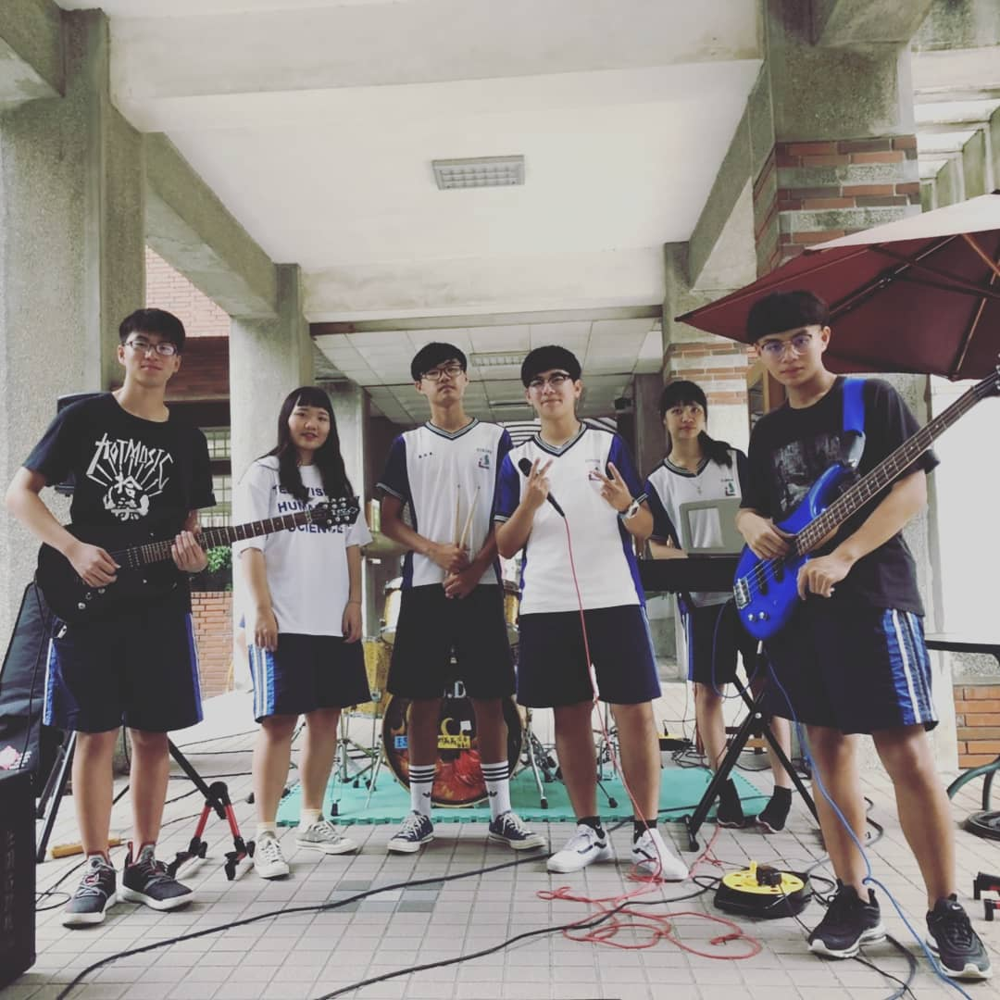
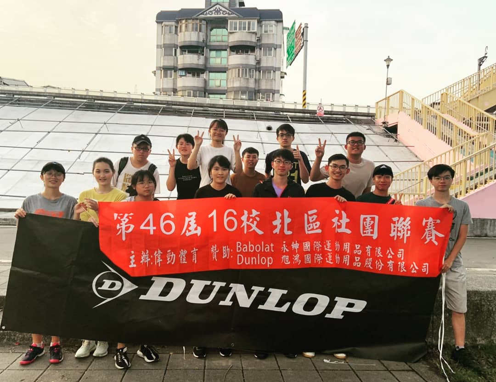

在社團的生活裡,就像是一個小團隊一樣,每一個人都必須分工合作,盡心盡力的
去教導學弟妹,帶領整個社團邁向更好的發展,而我的任務就是負責讓學弟妹們更
認識我們的社團,也教導他們學到社團所需具備的技能。
## 高中時期:熱音社副社長
- 舉辦過五校的聯合迎新活動
- 舉辦社團聯合成果發表會
- 學校校慶社團成果展表演

## 大學時期:網球社教學長
- 參與過北區十三校聯賽
- 與中原、中央聯合舉辦三校友誼賽
- 舉辦十元盃
- 參加學校新生盃獲得季軍
